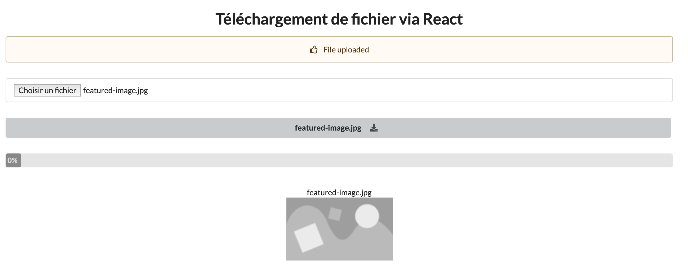
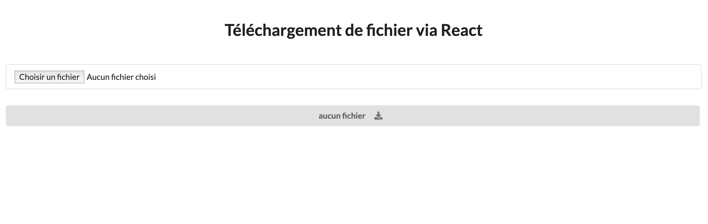

# Télécharger un ficher avec React :arrows_counterclockwise:

un exercice utilisant Express / React afin de télécharger un fichier

## Technos utilisées :
React
Express
Axios
Style UI : Semantic-UI

# file-upload-react
